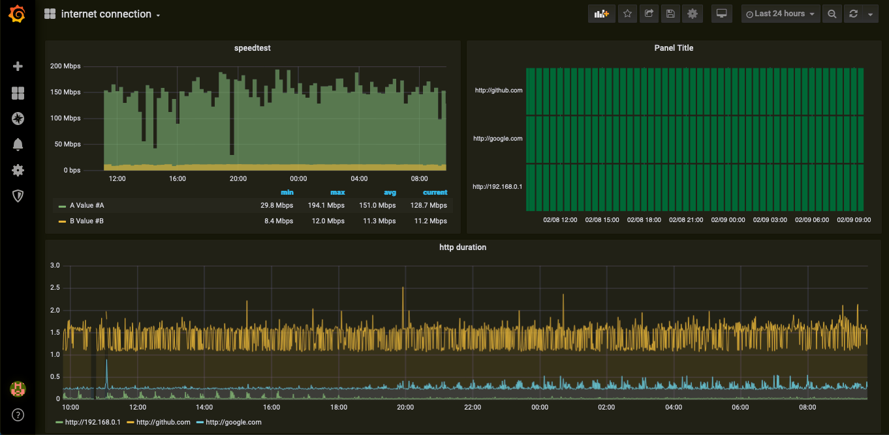

Raspberry pi version of: 
https://github.com/maxandersen/internet-monitoring

* new speedtester 
* new visuals
* works on RPI

# A Docker Stack which Monitors your home network
Here's a quick start to stand-up a Docker [Prometheus](http://prometheus.io/) stack containing Prometheus, Grafana with  [blackbox-exporter](https://github.com/prometheus/blackbox_exporter) and [prometheus-speedtest](https://github.com/jeanralphaviles/prometheus_speedtest) to collect and graph home network connections and speed.

## Pre-requisites
Before we get started installing the Prometheus stack. Ensure you install the latest version of docker and [docker-compose](https://docs.docker.com/compose/install/) on your Docker RPI. This has been tested with Docker on Raspberry pi 3+ with raspbian buster. Tuning would be needed for RPI version 4 for 64bit.

# Quick Start
run:

```
git clone https://github.com/bennyb0y/rpi-internet-monitoring
cd rpi-internet-monitoring/
docker-compose up
```

Goto [http://localhost:3030/d/o9mIe_Aik/internet-connection](http://localhost:3030/d/o9mIe_Aik/internet-connection) (change `localhost` to your docker host ip/name).

## Configuration
To change what hosts you ping you change the `targets` section in [/prometheus/pinghosts.yaml](./prometheus/pinghosts.yaml) file.

Once configurations are done let's start it up. From the /prometheus project directory run the following command:

    $ docker-compose up -d

That's it. docker-compose builds the entire Grafana and Prometheus stack automagically. 

The Grafana Dashboard is now accessible via: `http://<Host IP Address>:3030` for example http://localhost:3030

username - admin
password - wonka (Password is stored in the `config.monitoring` env file)

The DataSource and Dashboard for Grafana are automatically provisioned. 

If all works it should be available at http://localhost:3030/d/o9mIe_Aik/internet-connection - if no data shows up try change the timeduration to something smaller.

<center></center>

## Interesting urls

Note: replace `localhost` with your docker host ip/name if not running this locally.

http://localhost:9090/targets shows status of monitored targets as seen from prometheus - in this case which hosts being pinged and speedtest. note: speedtestnew (prometheus_speedtest) will take a while before it shows as UP as it takes ~45s to respond.

http://localhost:9090/graph?g0.expr=probe_http_status_code&g0.tab=1 shows prometheus value for `probe_http_status_code` for each host. You can edit/play with additional values. Useful to check everything is okey in prometheus (in case Grafana is not showing the data you expect).

http://localhost:9115 blackbox exporter endpoint. Lets you see what have failed/succeded.

http://localhost:9516/probe prometheus_speedtest exporter endpoint. Does take ~45 seconds to show its result as it runs an actual speedtest when requested.


## Thanks/Warnings

Thx to @maxandersen for building this and maintaining this. I only made edits.

The prometheus_speedtest will download +10g of testing data per day.
